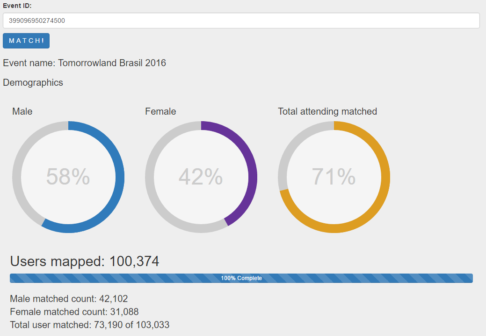

# fbeventgender [](https://travis-ci.org/deadkff01/fbeventgender) [](https://david-dm.org/deadkff01/fbeventgender) [](https://david-dm.org/deadkff01/fbeventgender#info=devDependencies)

>Facebook event gender with brute force.

</a>

## Limitations 

The application uses the Facebook Graph API and is subject to limitations.

<a href="https://developers.facebook.com/docs/graph-api/advanced/rate-limiting" target="_blank">API rate limiting</a>

## How does it work

More names... more you'll be able to map.
It's very simple, is just a chain of assync functions.


```js
    function attCountName() {
        FB.api('https://graph.facebook.com/'+$scope.eventId.value+'?fields=attending_count,name',
                    function (response) {
                      if (response && !response.error) {
                       $scope.eventAttendingCount = parseInt(response.attending_count);
                       $scope.eventname = response.name;
                       $scope.maleCount = 0;
                       $scope.femaleCount = 0;
                       $scope.mappedAttendings = 0;
                       $scope.$applyAsync();
                      }
                    }
        );
    }
    
    function firstNamesReq() {
        var def = $q.defer();
              FB.api('https://graph.facebook.com/'+$scope.eventId.value+'/attending?pretty=0&limit='+1300,
                     function (response) {
                       if (response && !response.error){
                        hasNextNames(response);
                        calcNames(response.data);
                        $scope.$applyAsync(); 
                        def.resolve(); 
                       } else {
                          def.reject(response.error);
                       }
                     }
              );
          return def.promise;
    }

    function nextNames() {
        if(eventNextNames != null){
            FB.api(eventNextNames,
                     function (response) {
                       if (response && !response.error){
                        hasNextNames(response);
                        calcNames(response.data);
                        $scope.$applyAsync(); 
                        return nextNames();
                      } 
              });
            } else {
               $scope.mappedPercent = 100; 
               return null;
            }
    }
```

and the execution...

```js
	  $scope.search = function() {
      var chain = $q.when();
      chain.then(attCountName())
           .then(
                firstNamesReq().then(function() {
                  nextNames();
                }, function(reason) {
                   console.log(reason);
                }));
    };
```
